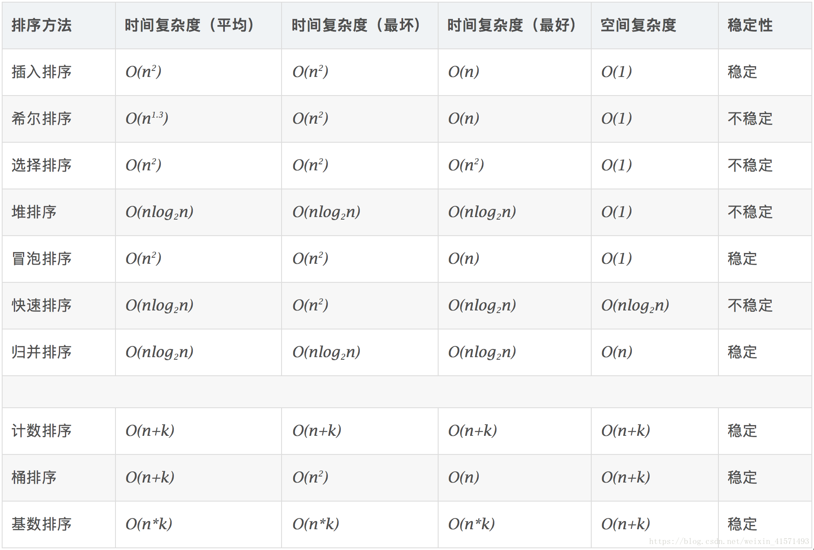

# 排序算法
各类算法复杂度分析;

## 交换排序

### 冒泡排序
- 思路
```angular2html
1. 比较相邻的元素。如果第一个比第二个大，就交换它们两个；
2. 对每一对相邻元素作同样的工作，从开始第一对到结尾的最后一对，这样在最后的元素应该会是最大的数；
3. 针对所有的元素重复以上的步骤，除了最后一个；
4. 重复步骤1~3，直到排序完成。

```


- 解法
```python
def bubble_sort(lst):
    n = len(lst)
    if n <= 1:
        return lst
    for i in range(n):
        for j in range(n-i-1):
            if lst[j] > lst[j+1]:
                lst[j],lst[j+1] = lst[j+1],lst[j]
    return lst
```

### 快速排序
- 思路
```angular2html
1. 从数列中挑出一个元素，称为 “基准”（pivot）；
2. 重新排序数列，所有元素比基准值小的摆放在基准前面，所有元素比基准值大的摆在基准的后面（相同的数可以到任一边）。在这个分区退出之后，该基准就处于数列的中间位置。这个称为分区（partition）操作；
3. 递归地（recursive）把小于基准值元素的子数列和大于基准值元素的子数列排序。
```


- 解法1(chatgpt提供)
```python
def quick_sort(lst):
    if len(lst) <= 1:
        return lst
    else:
        k = lst[0]
        less = [i for i in lst[1:] if i < k]
        greater = [i for i in lst[1:] if i >= k ]
        return quick_sort(less) + [k] + quick_sort(greater)

```

- 解法2
```python
def QuickSort(lst):
    def partition(arr,left,right):
        key = left
        while left < right:
            while left < right and arr[key] < arr[right]:
                right -= 1
            while left < right and arr[left]<= arr[key]:
                left += 1
        arr[left],arr[right] = arr[right],arr[left]
        return left
    def quicksort(arr,left,right):
        if left >= right:
            return
        mid = partition(arr,left,right)
        quicksort(arr,left,mid - 1)
        quicksort(arr, mid+1,right)
    
    n = len(lst)
    if n <= 1:
        return lst
    quicksort(lst,0,n-1)
    return lst
        
```

## 插入排序

### 简单插入排序
- 思路
```angular2html
1. 从第一个元素开始，该元素可以认为已经被排序；
2. 取出下一个元素，在已经排序的元素序列中从后向前扫描；
3. 如果该元素（已排序）大于新元素，将该元素移到下一位置；
4. 重复步骤3，直到找到已排序的元素小于或者等于新元素的位置；
5. 将新元素插入到该位置后；
6. 重复步骤2~5。
```

- 解法
```python
def insertsort(lst):
    n = len(lst)
    if len(n)<= 1:
        return lst
    for i in range(1,n):
        j = i 
        target = lst[j]
        while j > 0 and target < lst[j-1]:
            lst[j] = lst[j-1]
        lst[j] = target
    return lst
```

### 希尔排序
- 思路
```angular2html
选择一个增量序列t1，t2，…，tk，其中ti>tj，tk=1；
按增量序列个数k，对序列进行k 趟排序；
每趟排序，根据对应的增量ti，将待排序列分割成若干长度为m 的子序列，分别对各子表进行直接插入排序。仅增量因子为1 时，整个序列作为一个表来处理，表长度即为整个序列的长度。
```

- 解法
```python
def ShellSort(lst):
    def shellinsert(arr, d):
        n = len(arr)
        for i in range(d, n):
            j = i -d 
            tmp = arr[i]
            while j >= 0 and arr[j] > tmp:
                arr[j + d] = arr[j]
                j -= d
            if j != i -d:
                arr[j+d] = tmp
    n = len(lst)
    if n <= 1:
        return lst
    d = n // 2
    while d>=1:
        shellinsert(d,lst)
        d = d // 2
    return lst
```

## 选择排序

### 简单选择排序
- 思路
```angular2html
初始状态：无序区为R[1..n]，有序区为空；
第i趟排序(i=1,2,3…n-1)开始时，当前有序区和无序区分别为R[1..i-1]和R(i..n）。该趟排序从当前无序区中-选出关键字最小的记录 R[k]，将它与无序区的第1个记录R交换，使R[1..i]和R[i+1..n)分别变为记录个数增加1个的新有序区和记录个数减少1个的新无序区；
n-1趟结束，数组有序化了。
```

- 解法
```python
def select_sort(lst):
    n = len(lst)
    if n <= 1:
        return lst
    for i in range(n):
        min_ind = i
        for j in range(i+1,n):
            if lst[j] < lst[min_ind]:
                min_ind = j
        lst[i],lst[min_ind] = lst[min_ind],lst[i]
    return lst
            

```

###堆排序
- 思路
```angular2html
1. 将初始待排序关键字序列(R1,R2….Rn)构建成大顶堆，此堆为初始的无序区；
2. 将堆顶元素R[1]与最后一个元素R[n]交换，此时得到新的无序区(R1,R2,……Rn-1)和新的有序区(Rn),且满足R[1,2…n-1]<=R[n]；
3. 由于交换后新的堆顶R[1]可能违反堆的性质，因此需要对当前无序区(R1,R2,……Rn-1)调整为新堆，然后再次将R[1]与无序区最后一个元素交换，得到新的无序区(R1,R2….Rn-2)和新的有序区(Rn-1,Rn)。不断重复此过程直到有序区的元素个数为n-1，则整个排序过程完成。

```

- 解法
```python
def HeapSort(lst):
    def heapjust(arr, start, end):
        temp = arr[start]
        son = 2 * start +1
        while son <= end:
            if son < end and arr[son] <arr[son + 1]:
                son += 1
            if temp >= arr[son]:
                break
            arr[start] = arr[son]
            start = son
            son = 2 * son + 1
        arr[start] = temp
    n  = len(lst)
    if n < 1:
        return lst
    root = n //2
    while root >=0:
        heapjust(lst, root, n - 1)
        root -= 1
    i = n-1
    while i >= 0:
        lst[0],lst[i] = lst[i],lst[0]
        heapjust(lst,0, i-1)
        i -= 1
    return lst

```


## 归并排序
- 思路
```angular2html
1. 把长度为n的输入序列分成两个长度为n/2的子序列；
2. 对这两个子序列分别采用归并排序；
3. 将两个排序好的子序列合并成一个最终的排序序列。
```


- 解法
```python
def MergeSort(lst):
    def merge(arr,left, mid, right):
        tmp = []
        i = left
        j = mid + 1
        while i <= mid and j <= right:
            if arr[i] <= arr[j]:
                tmp.append(arr[i])
                i += 1
            else:
                tmp.append(arr[j])
                j += 1
        while i <= mid:
            tmp.append(arr[i])
            i += 1
        while j <= right:
            tmp.append(arr[j])
            j += 1
        for i in range(left,right + 1):
            arr[i] = tmp[i - left]
    def mSort(arr, left, right):
        if left >right:
            return
        mid = (left + right) // 2
        mSort(arr,left,mid)
        mSort(arr,mid+1, right)
        merge(arr,left,mid,right)
    
    n = len(lst)
    if n <= 1:
        return lst
    mSort(lst,0,n-1)
    return lst
                

```