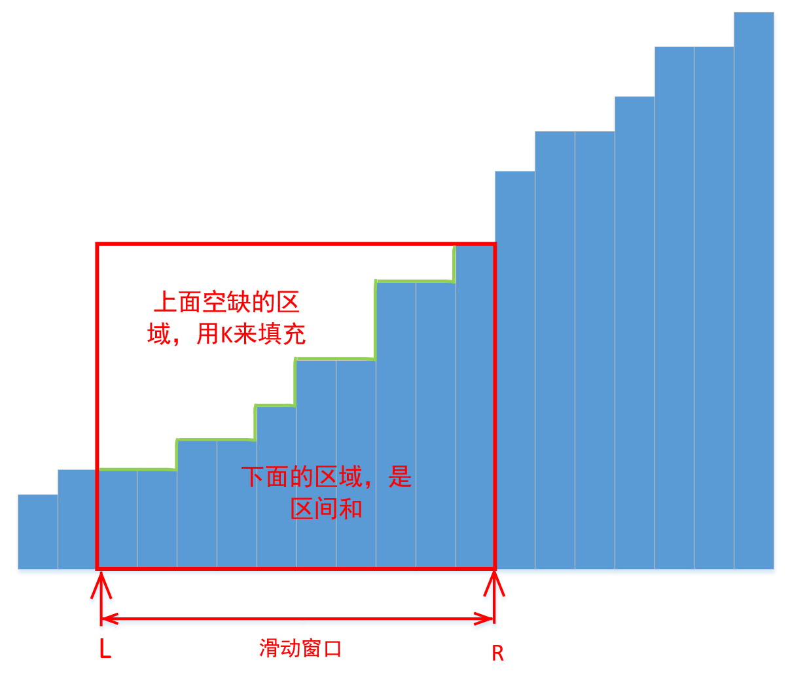

# 1838. 最高频元素的频数
地址: https://leetcode-cn.com/problems/frequency-of-the-most-frequent-element/


# 题目描述
元素的 频数 是该元素在一个数组中出现的次数。

给你一个整数数组 nums 和一个整数 k 。在一步操作中，你可以选择 nums 的一个下标，并将该下标对应元素的值增加 1 。

执行最多 k 次操作后，返回数组中最高频元素的 最大可能频数 。

示例1:
```
输入：nums = [1,2,4], k = 5
输出：3
解释：对第一个元素执行 3 次递增操作，对第二个元素执 2 次递增操作，此时 nums = [4,4,4] 。
4 是数组中最高频元素，频数是 3 。
```

示例2:
```
输入：nums = [1,4,8,13], k = 5
输出：2
解释：存在多种最优解决方案：
- 对第一个元素执行 3 次递增操作，此时 nums = [4,4,8,13] 。4 是数组中最高频元素，频数是 2 。
- 对第二个元素执行 4 次递增操作，此时 nums = [1,8,8,13] 。8 是数组中最高频元素，频数是 2 。
- 对第三个元素执行 5 次递增操作，此时 nums = [1,4,13,13] 。13 是数组中最高频元素，频数是 2 。

```


示例3:
```
输入：nums = [3,9,6], k = 2
输出：1

```

# 参考解法

## 思路




```python

class Solution:
    def maxFrequency(self, nums: List[int], k: int) -> int:
        n = len(nums)
        nums.sort()
        res = 0
        L = 0
        window_sum = 0
        ##### 滑动窗口
        for R in range(n):
            # --- 进R
            window_sum += nums[R] #窗口加起来，真实值相加
            #------ 弹L
            while window_sum + k < nums[R] * (R - L + 1): # 右边的是窗口长度乘以高度
                window_sum -= nums[L]
                L += 1
            res = max(res, R - L + 1)
        return res    

```


# 最优解法
```python
class Solution:
    def maxFrequency(self, nums: List[int], k: int) -> int:
        c=Counter(nums)
        res=sorted(c.keys())
        n=len(res)
        i=0
        ans=0
        ans=cnt=c[res[0]]
        cur=0
        for j in range(1,n):
            add=res[j]-res[j-1]
            cur+=add*cnt
            while cur>k:
                cnt-=c[res[i]]
                cur-=c[res[i]]*(res[j]-res[i])
                i+=1
            cnt+=c[res[j]]
            if i and cur<k:
                ans=max(ans,cnt+(k-cur)//(res[j]-res[i-1]))
            else:
                ans=max(ans,cnt)
        return ans


```
