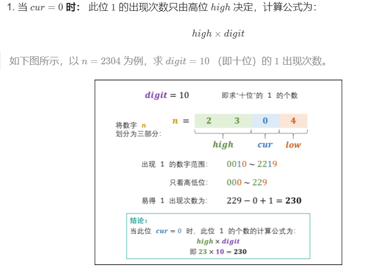
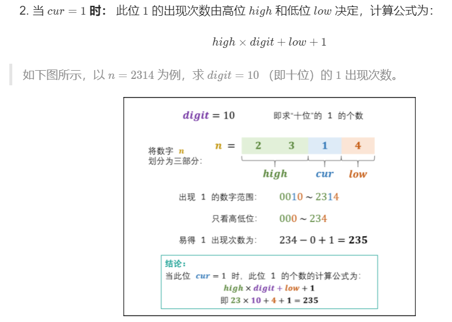
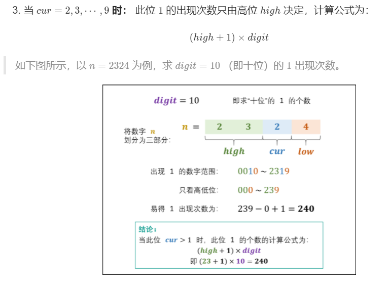

# 233. 数字 1 的个数
地址: https://leetcode-cn.com/problems/number-of-digit-one/


# 题目描述
给定一个整数 n，计算所有小于等于 n 的非负整数中数字 1 出现的个数。

 示例1:
 ```
输入：n = 13
输出：6

 ```

  示例2:
 ```
输入：n = 0
输出：0

 ```

 # 我的解法
 时间复杂度过高
 ```python

def getdigitOne(n):
    ans = [str(i).count('1') for i in range(n)]
    return sum(ans)


```

# 参考解法
## 思路
设数字 nn 是个 x 位数，记 n 的第 i 位为 $n_i$，则可将 n 写为 $n_{x} n_{x-1} \cdots n_{2} n_{1}$

- 称 " $n_in$ " 为 当前位 ，记为 cur ，
- 将 " $n_{i-1} n_{i-2} \cdots n_{2} n_{1}$" 称为 低位 ，记为 low ；
- 将 " $n_{x} n_{x-1} \cdots n_{i+2} n_{i+1}$" 称为 高位 ，记为 high。
- 将 $10^i$称为 位因子 ，记为 digit。
某位中 1 出现次数的计算方法：
根据当前位 cur 值的不同，分为以下三种情况：



变量递推公式：
设计按照 “个位、十位、...” 的顺序计算，则 high / cur / low / digit应初始化为：
```
high = n // 10
cur = n % 10
low = 0
digit = 1 # 个位

```
因此，从个位到最高位的变量递推公式为：
```
while high != 0 or cur != 0: # 当 high 和 cur 同时为 0 时，说明已经越过最高位，因此跳出
   low += cur * digit # 将 cur 加入 low ，组成下轮 low
   cur = high % 10 # 下轮 cur 是本轮 high 的最低位
   high //= 10 # 将本轮 high 最低位删除，得到下轮 high
   digit *= 10 # 位因子每轮 × 10

```

```python
class Solution:
    def countDigitOne(self, n: int) -> int:
        digit, res = 1, 0
        high, cur, low = n // 10, n % 10, 0
        while high != 0 or cur != 0:
            if cur == 0: res += high * digit
            elif cur == 1: res += high * digit + low + 1
            else: res += (high + 1) * digit
            low += cur * digit
            cur = high % 10
            high //= 10
            digit *= 10
        return res


```


# 最优解法
```python
class Solution(object):
    def countDigitOne(self, n):
        """
        :type n: int
        :rtype: int
        """

        sn = str(n)
        k = len(sn)

        tn,tsub = 0,0

        for i in range(k):
            m = int(sn[-i -1])
            if m == 1:
                if i == 0:
                    tsub = 1
                else:
                    tsub = int(sn[k-i:])+1 + tn + tsub
            if m > 1:
                tsub = int(sn[k-i-1]) * tn + 10 ** i + tsub
            tn = tn * 10 + 10 ** i

        return tsub


```