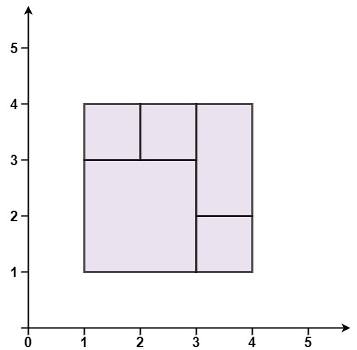
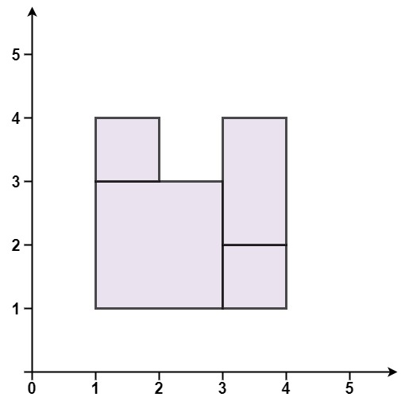

# 391. 完美矩形
地址:https://leetcode-cn.com/problems/perfect-rectangle/

# 题目描述
给你一个数组 rectangles ，其中 rectangles[i] = [xi, yi, ai, bi] 表示一个坐标轴平行的矩形。这个矩形的左下顶点是 (xi, yi) ，右上顶点是 (ai, bi) 。

如果所有矩形一起精确覆盖了某个矩形区域，则返回 true ；否则，返回 false 。

示例1

```
输入：rectangles = [[1,1,3,3],[3,1,4,2],[3,2,4,4],[1,3,2,4],[2,3,3,4]]
输出：true
解释：5 个矩形一起可以精确地覆盖一个矩形区域。 

```

示例2

```

输入：rectangles = [[1,1,2,3],[1,3,2,4],[3,1,4,2],[3,2,4,4]]
输出：false
解释：两个矩形之间有间隔，无法覆盖成一个矩形。
```


示例3

```

输入：rectangles = [[1,1,3,3],[3,1,4,2],[1,3,2,4],[3,2,4,4]]
输出：false
解释：图形顶端留有空缺，无法覆盖成一个矩形。

```

示例4

```
输入：rectangles = [[1,1,3,3],[3,1,4,2],[1,3,2,4],[2,2,4,4]]
输出：false
解释：因为中间有相交区域，虽然形成了矩形，但不是精确覆盖。


```

# 我的解法
没写出来


# 参考解法
```python


class Solution:
    def isRectangleCover(self, rectangles: List[List[int]]) -> bool:
        area, minX, minY, maxX, maxY = 0, rectangles[0][0], rectangles[0][1], rectangles[0][2], rectangles[0][3]
        cnt = defaultdict(int)
        for rect in rectangles:
            x, y, a, b = rect[0], rect[1], rect[2], rect[3]
            area += (a - x) * (b - y)

            minX = min(minX, x)
            minY = min(minY, y)
            maxX = max(maxX, a)
            maxY = max(maxY, b)

            cnt[(x, y)] += 1
            cnt[(x, b)] += 1
            cnt[(a, y)] += 1
            cnt[(a, b)] += 1

        if area != (maxX - minX) * (maxY - minY) or cnt[(minX, minY)] != 1 or cnt[(minX, maxY)] != 1 or cnt[(maxX, minY)] != 1 or cnt[(maxX, maxY)] != 1:
            return False

        del cnt[(minX, minY)], cnt[(minX, maxY)], cnt[(maxX, minY)], cnt[(maxX, maxY)]

        return all(c == 2 or c == 4 for c in cnt.values())

```

