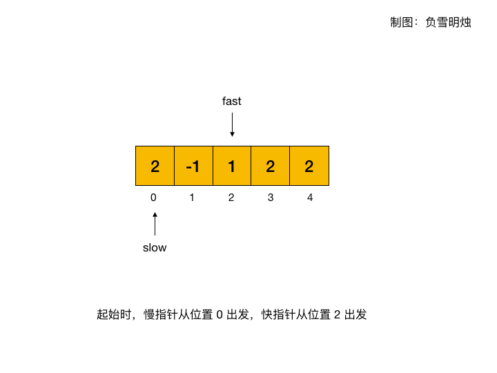

# 457. 环形数组是否存在循环
地址:https://leetcode-cn.com/problems/circular-array-loop/

# 题目描述
存在一个不含 0 的 环形 数组 nums ，每个 nums[i] 都表示位于下标 i 的角色应该向前或向后移动的下标个数：

- 如果 nums[i] 是正数，向前 移动 nums[i] 步
- 如果 nums[i] 是负数，向后 移动 nums[i] 步

因为数组是 环形 的，所以可以假设从最后一个元素向前移动一步会到达第一个元素，而第一个元素向后移动一步会到达最后一个元素。

数组中的 循环 由长度为 k 的下标序列 seq ：
- 遵循上述移动规则将导致重复下标序列 seq[0] -> seq[1] -> ... -> seq[k - 1] -> seq[0] -> ...
- 所有 nums[seq[j]] 应当不是 全正 就是 全负
- k > 1

如果 nums 中存在循环，返回 true ；否则，返回 false 。

示例1:
```
输入：nums = [2,-1,1,2,2]
输出：true
解释：存在循环，按下标 0 -> 2 -> 3 -> 0 。循环长度为 3 。

```


示例2:
```
输入：nums = [-1,2]
输出：false
解释：按下标 1 -> 1 -> 1 ... 的运动无法构成循环，因为循环的长度为 1 。根据定义，循环的长度必须大于 1 。

```


示例3:
```
输入：nums = [-2,1,-1,-2,-2]
输出：false
解释：按下标 1 -> 2 -> 1 -> ... 的运动无法构成循环，因为 nums[1] 是正数，而 nums[2] 是负数。
所有 nums[seq[j]] 应当不是全正就是全负。

```


# 我的解法
## 思路
按照题目描述的评判标准，遍历整个序列，如果找到满足条件的循环序列，则直接返回true,全部遍历结束之后，如果不存在，则直接返回false.

```python
class Solution:
    def circularArrayLoop(self, nums: List[int]) -> bool:
        lens = len(nums)
        for i in range(lens):
            old = i
            tmp = [i]
            ne = (i + nums[i]) %lens
            times = 0
            while nums[old] * nums[ne]> 0 and times < lens:
                # 只有前后两个数是同号，并且循环次数小于序列长度
                if ne == tmp[0]:
                    new_ne = (ne + nums[ne]) %lens
                    if len(tmp) > 1 and new_ne == tmp[1] and tmp[0] != tmp[1]:
                        return True
                tmp.append(ne)
                old  = ne
                ne = (ne + nums[ne]) % lens
                times += 1
        return False


```


# 参考解法
## 思路
快慢指针，在链表问题中，快指针每次走 2 步，慢指针每次走 1 步。当快慢指针相遇的时候，说明存在环。
具体流程是：

- 在每次移动中，快指针需要走 2 次，而慢指针需要走 1 次；
- 每次移动的步数等于数组中每个位置存储的元素；
- 当快慢指针相遇的时候，说明有环。
起始时，让快指针先比慢指针多走一步，当两者在满足题目的两个限制条件的情况下，快慢指针能够相遇，则说明有环。

这个题难点在于题目的两个限制条件：
​

- 在每次循环的过程中，必须保证所经历过的所有数字都是同号的。
那么，在快指针经历过的每个位置都要判断一下和出发点的数字是不是相同的符号。
- 当快慢指针相遇的时候，还要判断环的大小不是 1。
所以，找到相遇点的位置后，如果再走 1 步，判断是不是自己。

下面的动图展示了在环形数组 [2, -1, 1, 2, 2] 中，如何利用快慢指针寻找判断环形数组中是否存在环。



```python
class Solution:
    def circularArrayLoop(self, nums: List[int]) -> bool:
        n = len(nums)
        nxt = lambda x : (x + nums[x]) % n #获取下一个指针位置的函数

        for i in range(n):
            if nums[i] == 0 : continue
            slow = i # 慢指针
            fast = nxt(i) #快指针，初始在慢指针的下一个位置

            while nums[slow] * nums[fast] > 0 and nums[fast] * nums[nxt(fast)] > 0:
                # 快慢指针同号，并且快指针下一个位置也同号
                if slow == fast: #如果快指针和慢指针相同
                    if slow == nxt(slow): # 但是循环长度为1
                        break
                    else: #循环长度不为1，则直接返回true
                        return True
                slow = nxt(slow) # 慢指针每次只走一步
                fast = nxt(nxt(fast)) #快指针每次走两步
            while nums[i] > 0: #在此次i遍历的流程中的所有节点都置为0，即不需要再遍历
                tmp = nxt(i)
                nums[i] = 0 
                i = tmp
        return False


```