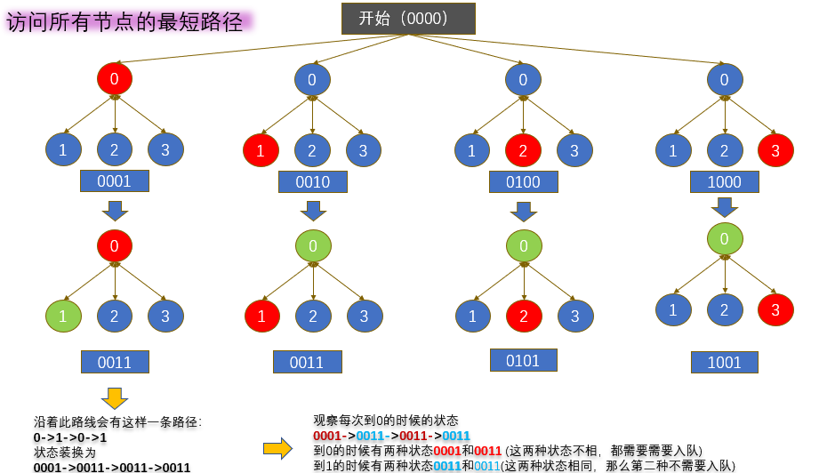

# 847. 访问所有节点的最短路径
地址:https://leetcode-cn.com/problems/shortest-path-visiting-all-nodes/


# 题目描述
存在一个由 n 个节点组成的无向连通图，图中的节点按从 0 到 n - 1 编号。

给你一个数组 graph 表示这个图。其中，graph[i] 是一个列表，由所有与节点 i 直接相连的节点组成。

返回能够访问所有节点的最短路径的长度。你可以在任一节点开始和停止，也可以多次重访节点，并且可以重用边。


示例1

```
输入：graph = [[1,2,3],[0],[0],[0]]
输出：4
解释：一种可能的路径为 [1,0,2,0,3]

```

示例2

```
输入：graph = [[1],[0,2,4],[1,3,4],[2],[1,2]]
输出：4
解释：一种可能的路径为 [0,1,4,2,3]

```

# 我的解法
没有做出来，今天不在状态

# 参考解法1
## 思路
Python按位运算
```
python按位运算是把数字看作二进制来进行计算的
|在python中是指或运算
<<:左边的数字（二进制）左移多少位
>>:左边的数字（二进制）右移多少位
```
下面进入正题，先看图：


这道题是属于图的题目，而且求最短路径，那么肯定是BFS
涉及到图，我们肯定是需要设置visited的，那么这里的visited里面是放每次访问的节点吗？但是题目要求
也可以多次重访节点，并且可以重用边，所有这里很显然visited中不是存放每次访问的节，那么在想想，我们每次到某个节点，但是这个节点之前访问过（因为可以重复使用），但是此时的路径不同，那么还是可以入队的, 图中有文字说明！
那么如何判断路径相同呢？使用位预算，只要访问过就置为1，所以使用位运算，所以visited中存放的是每次访问到固定节点的时候的状态，如果状态相同说明就是相同的路径，不必要入队！！

```python
class Solution:
    def shortestPathLength(self, graph: List[List[int]]) -> int:
        if graph == [[]]:
            return 0
        lens = len(graph)
        target = (1<<lens) - 1 #全1
        states = {i:1<<i for i in range(lens)}
        que = [(i,states[i]) for i in range(lens)]
        visited = {i:[states[i]] for i in range(lens)}
        path = 0

        while que:
            n = len(que)
            path += 1
            for _ in range(n):
                i,cur_state = que.pop(0)


                for ner in graph[i]:
                    neibor_state = cur_state | states[ner]
                    if neibor_state == target:
                        return path
                    if neibor_state not in visited[ner]:
                        visited[ner].append(neibor_state)
                        que.append((ner,neibor_state))
        return -1
```
时间复杂度有点高，超越人数不多


# 参考解法2
思路：
同上，但是使用的数据结构比较好，使用双向队列，节省时间开销
```python
class Solution:
    def shortestPathLength(self, graph: List[List[int]]) -> int:
        lens = len(graph)
        target = (1<<lens) - 1
        que = deque()
        visited = set()

        for i in range(lens):
            que.append((i,0,1<<i))
        
        while que:
            pos,cost,flag = que.popleft()
            
            if flag == target:
                return cost
            
            for node in graph[pos]:
                new_pos,new_cost,new_flag = node,cost+1,flag | (1<<node)
                if (new_pos,new_flag) not in visited:
                    visited.add((new_pos,new_flag))
                    que.append((new_pos,new_cost,new_flag))
        return -1
```

# 最优解法

```python
class Solution:
    def shortestPathLength(self, graph: List[List[int]]) -> int:
        # Time: O(n * 2^n)
        # Space: O(n * 2^n)
        n = len(graph)
        q = collections.deque()
        visited = set()
        for startPos in range(n):
            startStatus = (1 << startPos)
            visited.add((startPos, startStatus))
            q.append((startPos, startStatus, 0))
        endStatus = (1 << n) - 1
        while q:
            pos, status, d = q.popleft()
            if status == endStatus:
                return d
            for nextPos in graph[pos]:
                nextStatus = status | (1 << nextPos)
                if (nextPos, nextStatus) not in visited:
                    visited.add((nextPos, nextStatus))
                    q.append((nextPos, nextStatus, d + 1))
```