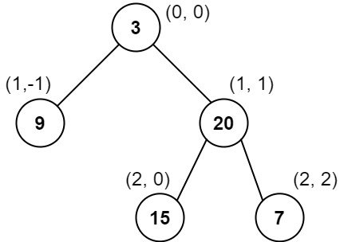

# 987. 二叉树的垂序遍历
地址： https://leetcode-cn.com/problems/vertical-order-traversal-of-a-binary-tree/


# 题目描述
给你二叉树的根结点 root ，请你设计算法计算二叉树的 垂序遍历 序列。
对位于 (row, col) 的每个结点而言，其左右子结点分别位于 (row + 1, col - 1) 和 (row + 1, col + 1) 。树的根结点位于 (0, 0) 。

二叉树的 垂序遍历 从最左边的列开始直到最右边的列结束，按列索引每一列上的所有结点，形成一个按出现位置从上到下排序的有序列表。如果同行同列上有多个结点，则按结点的值从小到大进行排序。

返回二叉树的 垂序遍历 序列。


示例1：

```
输入：root = [3,9,20,null,null,15,7]
输出：[[9],[3,15],[20],[7]]
解释：
列 -1 ：只有结点 9 在此列中。
列  0 ：只有结点 3 和 15 在此列中，按从上到下顺序。
列  1 ：只有结点 20 在此列中。
列  2 ：只有结点 7 在此列中。

```

示例2：

```
输入：root = [1,2,3,4,5,6,7]
输出：[[4],[2],[1,5,6],[3],[7]]
解释：
列 -2 ：只有结点 4 在此列中。
列 -1 ：只有结点 2 在此列中。
列  0 ：结点 1 、5 和 6 都在此列中。
          1 在上面，所以它出现在前面。
          5 和 6 位置都是 (2, 0) ，所以按值从小到大排序，5 在 6 的前面。
列  1 ：只有结点 3 在此列中。
列  2 ：只有结点 7 在此列中。

```

示例3：

```
输入：root = [1,2,3,4,6,5,7]
输出：[[4],[2],[1,5,6],[3],[7]]
解释：
这个示例实际上与示例 2 完全相同，只是结点 5 和 6 在树中的位置发生了交换。
因为 5 和 6 的位置仍然相同，所以答案保持不变，仍然按值从小到大排序。
```

# 我的解法
## 思路：
先通过深度优先遍历，生成各个节点的横纵坐标，然后，再根据题意，针对列和行进行排序。


```python
# Definition for a binary tree node.
# class TreeNode(object):
#     def __init__(self, val=0, left=None, right=None):
#         self.val = val
#         self.left = left
#         self.right = right
class Solution(object):
    def verticalTraversal(self, root):
        """
        :type root: TreeNode
        :rtype: List[List[int]]
        """
        def dfs(root,indy,indx,result=[]):
            if not root:
                return result
            result.append((root.val,indy,indx))
            dfs(root.left,indy-1,indx+1,result)
            dfs(root.right,indy+1,indx+1,result)
            return result
        result = dfs(root,0,0)
        dic = {}
        for i,j,k in result:
            if j not in dic:
                dic[j] = [(i,k)]
            else:
                dic[j].append((i,k))
        ans = sorted(dic.items(), key = lambda x:x[0])
        ans = [j for i,j in ans]
        res = []
        for i in ans:
            lens = len(i)
            if lens == 1:
                res.append([i[0][0]])
            else:
                tmp = {}
                for ii,j in i:
                    if j not in tmp:
                        tmp[j] = [ii]
                    else:
                        tmp[j].append(ii)
                sm = sorted(tmp.items(), key = lambda x:x[0])
                sm = [sorted(j) for i,j in sm]
                sm = [v for jj in sm for v in jj]
                res.append(sm)
        return res


```
# 太激动了！！！
我第一次把困难的题目做出来了，而且，最优的时间复杂度！！！


# 参考解法
```python
class Solution(object):
    def verticalTraversal(self, root):
        """
        :type root: TreeNode
        :rtype: List[List[int]]
        """
        dic = {} #key值表示列，行值 (列值，行值)， values表示该节点的值
        def helper(root, col, row):
            if root.left:
                helper(root.left, col-1, row+1)
            if root.right:
                helper(root.right, col+1, row+1)
            if (col,row) in dic:
                dic[(col,row)].append(root.val)
            else:
                dic[(col,row)] = [root.val]
        helper(root, 0, 0)
        coord = list(dic.keys()) #转换成列表
        coord.sort() #进行排序
        res = [] #需要返回的结果
        prev_x = None
        # 排序方法
        for (x,y) in coord:
            curr = dic[(x,y)] #第x列，第y行的数
            curr.sort() #对同一列，同一行的数进行排序
            if prev_x == x: #如果当前列等于前一列
                res[-1].extend(curr) #直接在后面扩展即可
            else:
                res.append(curr) # 不是同一列，则直接添加到后面即可
            prev_x = x
        return res
```
备注: 该算法的空间复杂度会小很多